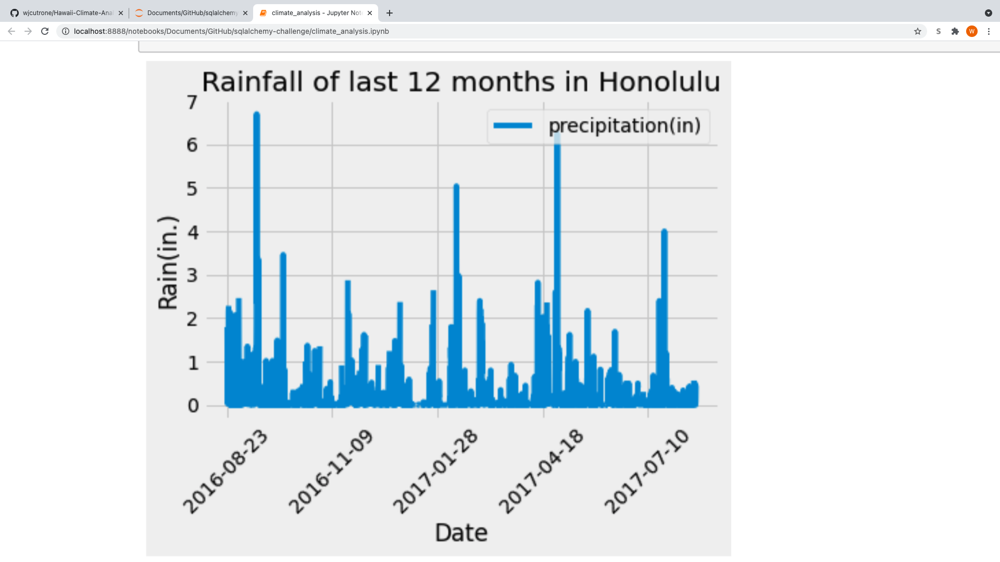
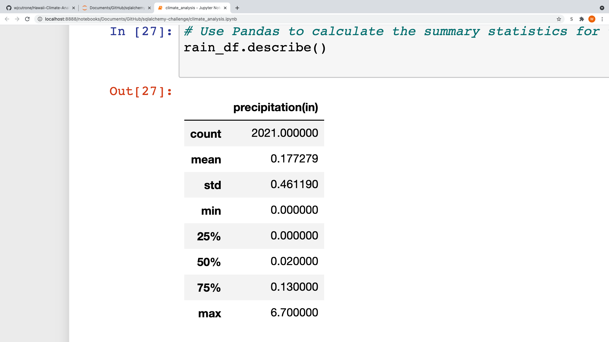
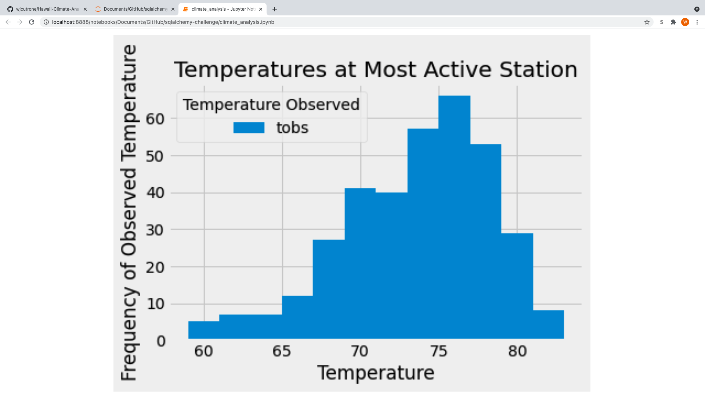
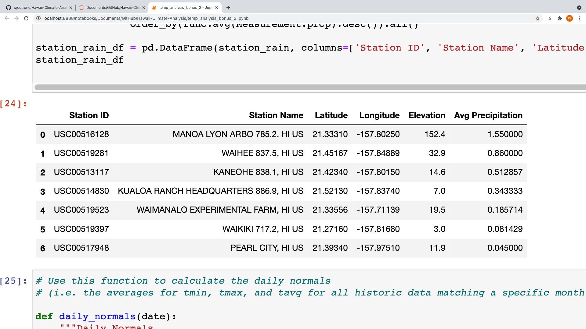
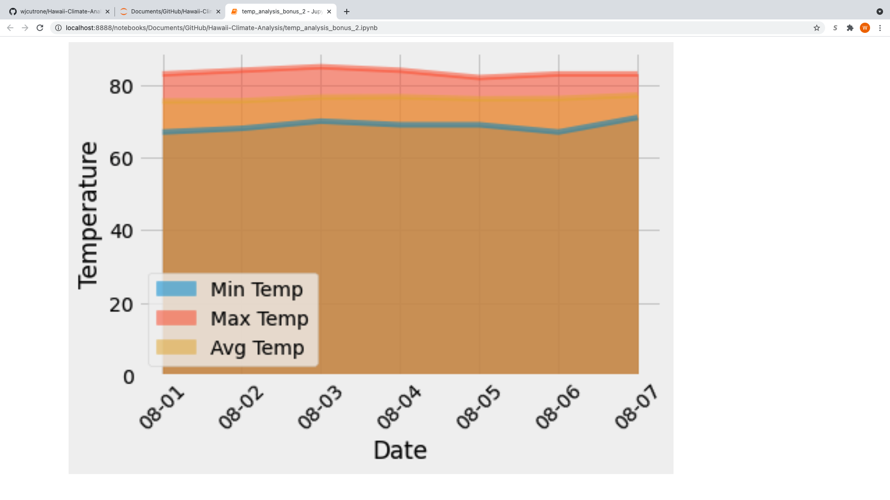

# Hawaii Climate Analysis
The objective of this repository was to perform climate analysis in the region of Honolulu, Hawaii. The process began with using Python to analyze data from a SQL database. The source data comes from the hawaii.sqlite file. Within this database are two tables: one contains various weather measurements on different dates, and the other contains data on each of the different weather stations in the region used to monitor the climate. In order to connect python to the sqlite database, SQLAlchemy was utilized via creating an sqlalchemy session. SQLAlchemy was also used to reflect the two tables in the database into python classes.  

After the session was created, the first task was to analyze the precipitation in the area during the last 12 months. The date examined was from August of 2016 to August of 2017. The precipiation data was first loaded into a Pandas dataframe, and then displayed in a barchart. Pandas was also used to print the summary statistics for the precipiation data. The bar graph and summary statistics can be seen below.

The next task was to analyze the different weather stations in the area. The first step was to find the most active station in the area, meaning the one with the most measurements/observations. Next, I found the lowest, highest, and average temperature observed at that station during hte last 12 months. In addition, another bar graph was made that shows all the different temperatures recorded during the most recent 12 months of the dataset as well the frequency of which those temperatures were recorded.

After performing this analysis in python, the session was closed and I then transitioned to making a basic climate app using the Flask api. The climate app contains a homepage as well several different routes. Functions of the additional routes include seeing precipitation from the last 12 months, seeing data from the various weather stations, seeing temperature data on different dates. One of the routes even allows user to see all temperature data from any desired date range in the dataset, which would be useful for say someone wanting to plan a vacation to the area and wanting to know what the weather looks like during that period. An example can be seen below, for this example I used the first 7 days of August as my hypothetical vacation period. After inputing the dates, the app will show me the min, max and average temperature for that time period.

Another analysis performed was using python to investigate the question of whether one could consider Hawaii to "have a mild climate". In order to investigate this question, I examined weather from both June and December to see how similar the temperatures were. My results found the average temperature in June across all years in the dataset was about 74 degrees fahrenheit, and in December it was about 71 degrees Fahrenheit. The two differences in means were also statistically significant as the p-value obtained when performing the paired-ttest was 2.7e-170.

Lastly, the final analysis performed was using python to investigate rainfall and temperature during a hypothetical vacation period, which in this case was August 1st to August 7th. I wanted to show what the rainfall and temperature are like during these given days throughout the years in the dataset in order to see whether or not this a good week to visit Honolulu, Hawaii. Below is a dataframe showing the average daily rainfall at each station during the dates specificied, and an area plot showing the min, max, and average temperature in the area during the specificed dates.

